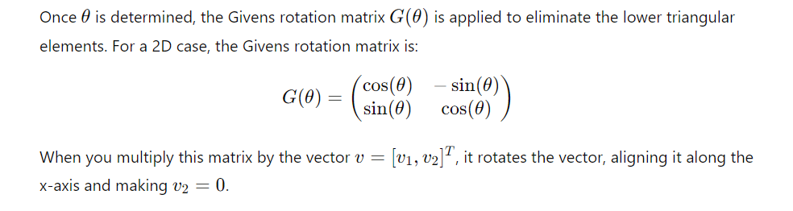
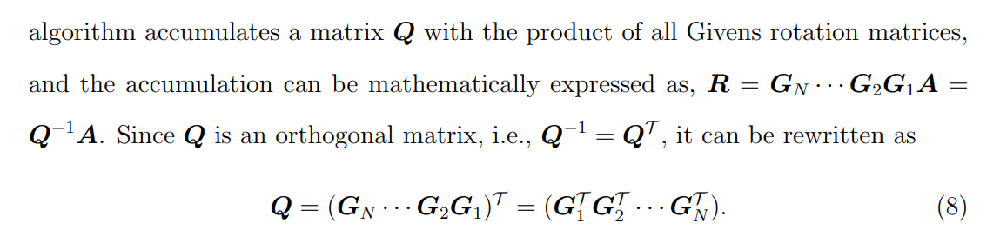

# QR Decomposition (QRD)
- The goal of QRD is to transform the matrix 
𝐴
A into this form while preserving its essential properties.

- the key to conduct a QRD is to
efficiently annihilate the elements located in the lower-triangular part of the matrix.

- Givens rotations are one of the methods used to perform QR decomposition. The idea is to apply rotations that selectively eliminate the lower triangular elements of the matrix, eventually converting 
𝐴
A into an upper triangular matrix 
𝑅
R.

- A Givens rotation matrix is used to zero out a specific element in the matrix. For a 2D vector 
𝑣
=
[
𝑣
1
,
𝑣
2
]
𝑇
v=[v 
1
​
 ,v 
2
​
 ] 
T
 , we can rotate it by an angle 
𝜃
θ to align it along one of the coordinate axes, eliminating one of the components.

 
*Figure 1: Given Rotaion Example*

 
*Figure 2: QRD and Cordic*

 
*Figure 3: QRD*

---

## Observation 1: Applying Givens Rotations Affects Only Two Rows
**Key Point:** When you apply a Givens rotation matrix to eliminate an element in the matrix 
𝐴
A, the operation affects only the two rows involved in the rotation. Specifically, if you are applying a Givens rotation to rows 
𝑖
i and 
𝑘
k, the rest of the matrix 
𝐴
A remains unchanged.

**Explanation:**
A Givens rotation matrix is designed to rotate only the two rows 
𝑖
i and 
𝑘
k to eliminate a specific element, typically in row 
𝑘
k, while preserving the relationship between the elements in row 
𝑖
i.
Instead of applying the Givens rotation to the entire matrix, you can apply the rotation to just rows 
𝑖
i and 
𝑘
k of the matrix. This reduces the number of computations, since you're not modifying the other rows.
For instance, in a 
3
×
3
3×3 matrix, to eliminate an element in row 2 using a rotation between rows 1 and 2, you only apply the rotation to these two rows, leaving row 3 unchanged.  
**Implication:** This optimization means that only the rows involved in the rotation need to be updated, which makes the algorithm more efficient.

## Observation 2: Diminishing Problem Size (Column-wise and Top-to-Bottom Application)
**Key Point:** As you move from one column to the next, the size of the problem reduces. Once you complete the QRD for one column, the remaining QRD task focuses on a smaller sub-matrix, simplifying the process.

**Explanation:**
The Givens QRD algorithm proceeds column by column, eliminating the non-zero elements below the diagonal in each column. After you finish triangularizing the first column, the problem reduces to a smaller matrix, specifically the lower-right sub-matrix.
For example, in a 
3
×
3
3×3 matrix:
After applying the Givens rotation to eliminate the element in the first column (in the second and third rows), you have an upper triangular structure for the first column.
At this point, the remaining QRD problem is to triangularize the 
2
×
2
2×2 lower-right sub-matrix, reducing the dimension of the problem.
The same pattern holds for larger matrices: once a column is normalized, the remaining QRD focuses on the smaller sub-matrix in the lower-right corner.  
**Implication:** This reduction in problem size leads to fewer operations as you progress through the matrix, which further optimizes the algorithm. The complexity decreases as you deal with smaller and smaller sub-matrices during the decomposition process.

---
